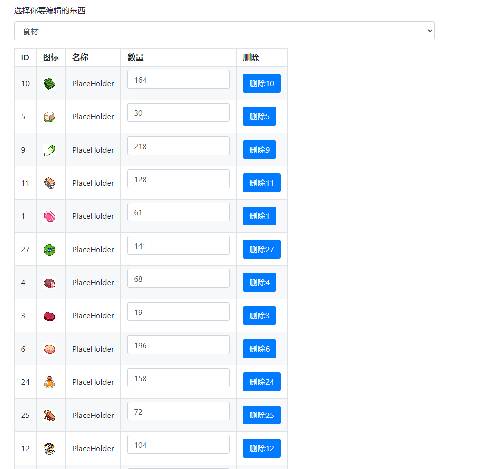

东方夜雀食堂 - Touhou Mystia's Izakaya 存档编辑器
================================
[](https://github.com/foxwhite25/TMLSaveEditor/blob/main/LICENSE)

* [简介](#简介)
* [目前可以修改的东西](#目前可以修改的东西)
* [截图](#截图)
* [安装](#安装)
    + [通用](#通用)
    + [使用python版本](#使用python版本)
* [存档文件路径](#存档文件路径)
* [使用方法](#使用方法)
* [更新日志](#更新日志)
* [为什么这个程序运行不了?](#为什么这个程序运行不了?)
* [公告](#公告)
* [编译](#编译)

## 简介

这是一个为了 [东方夜雀食堂](https://store.steampowered.com/app/1584090) 而制作的存档编辑器。

Python 版本在 Windows，Linux 和 macOS 都可以使用。

Windows系统也有 `.exe` 的版本.

他可以加载和保存 `*.memory` 文件。

说白了其实就只是一个json而已，任何文件编辑器都能够打开。

**这个程序使用浏览器作为GUI** (默认使用Chrome，但在开发期间Firefox也能够运行 - f.e. Opera 应该也能行

我想补充一点，如果你破坏了保存文件，我概不负责，你可以尝试把存档文件发到Issues，我也会尝试以使它不会破坏保存文件的方式维护此编辑器，但编辑器仍有可能产生错误的保存文件（例如，如果你添加了不存在的物品）。

### 这也是为什么你应该 **备份你的存档**。 

## 目前可以修改的东西

* 金钱
* 等级
* 经验值
* 食材
* 酒水

### 未来(希望)将支持的东西

* 菜谱
* 特别客人好感
* 有什么其他建议可以去issue提

## 截图



## 安装

### 通用
如果你已经有安装了Python，你可以直接下载`master`分支然后前往[使用Python版本](#使用Python版本).
这样的安装在大部分OS都可用 (Windows，Linux，macOS)。

**如果你在Windows系统并且没有安装Python**，你可以下载一个包含`.exe` 的 `.zip` 文件。 你可以在 [releases](https://github.com/foxwhite25/TMLSaveEditor/releases) 找到下载。这个压缩包包含了Python和所有需要的前置。

### 使用Python版本

* `git clone https://github.com/foxwhite25/TMLSaveEditor.git`
* 安装Python (>=3.7)
* 如果你使用Mac或者Linux系统，默认的 `python` 是 Python 2.x，把 `python` 换成 `python3`。 并且如果你的distro没有包含 `python-tk` 你需要自行安装。 
* 安装依赖 `python -m pip install -r requirements.txt`。
* 运行文件 `python main.py` (在包含`main.py`文件夹的中开启终端 - 要简化这步可以创建一个 `run.bat` (Windows) 或者 `run.sh` (Linux))
* Enjoy


## 存档文件路径

Linux / Ubuntu:

* `/home/$USER/.config/unity3d/Epicomic/Touhou Mystia Izakaya/Memory/Save`

MacOS:

* `/Users/$USER/Library/Application Support/unity.Epicomic.TouhouMystiaIzakaya/Memory/Save`

Windows:

* `C:\Users\%username%\AppData\LocalLow\Epicomic\Touhou Mystia Izakaya\Memory\Save`

## 使用方法

考虑到应用程序有一个 GUI，它应该是不言自明的。
当你运行程序的时候，会弹出一个选择文件的窗口，选择你想要编辑的文件。
接下来你的浏览器会弹出来，使用浏览器做UI。
每次切换页面的时候都会保存。

## 为什么这个程序运行不了?

给我一张你的终端的截图（或者复制文字也行）。
如果你使用编译的`.exe`版本，然后程序直接打不开，那就代表程序崩溃了。如果要提供你的终端，你可以这样做。
在有 .exe 文件的文件夹，在空白区域`Shift + 右键` ，菜单应该有个`在此处开启cmd` 或者 `在此处开启 Powershell`，然后输入 `./main.exe`。这次的窗口就不会关闭，你也有机会可以获取错误。

## 公告

这个仓库包含我不拥有的东西。
尤其是所有在`/Sprites`的图像文件。这些是由 [二色幽紫蝶](https://space.bilibili.com/86865890/) 所创造的。
如果你找到问题/BUG欢迎提Issue，或者如果你知道怎么修复，也可以创建一个Pull Request。

## 编译

对于那些感兴趣的人，这是我用来生成文件夹的命令，然后我将其压缩并作为发布上传：

```batch
pyinstaller main.spec --onefile --windowed
copy .\TMLSaveEditor\Sprite .\dist\main\Sprite
pause
```

在主目录有个文件叫 `main.spec` ，他是用来告诉pyinstaller要怎么做的: